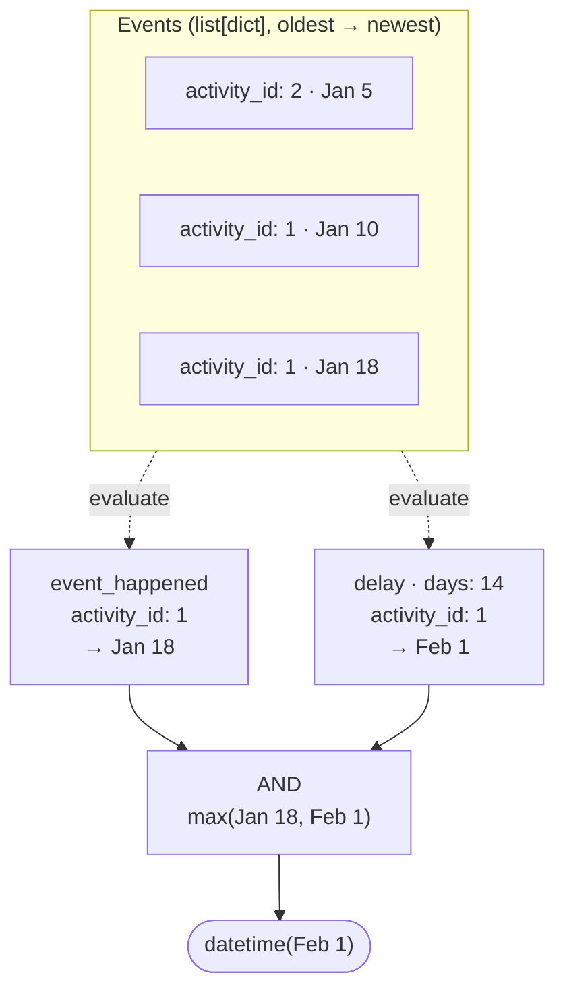

# londec — Longenesis Decision Maker

Evaluate tree-structured, JSON-serializable conditions against an ordered history of typed events. Each condition resolves to either `False` or the `datetime` it was first satisfied — enabling eligibility checks, scheduling triggers, and automation rules that are stored as data, not code.



---

## The problems londec solves

### Rules stored in a database, not compiled into code

Most eligibility and scheduling logic ends up hardcoded: a release changes which participants qualify, a new study arm requires a code deploy. londec conditions are plain Python dicts — JSON-serializable, storable in a database, editable through a UI, and passed to `londec.decide` at runtime. The logic lives in data, not in a release.

```python
# Stored in DB, loaded at runtime — no code change needed to update the rule
condition = {
    "type": "AND",
    "list": [
        {"type": "event_happened", "activity_id": 12},
        {"type": "event_happened_fewer_than", "activity_id": 15, "x": 3},
        {"type": "available_on_date_range", "start_date": "2026-01-01", "end_date": "2026-06-30", "timezone_offset": 120},
    ]
}

result = londec.decide(condition, events=person_events, field_map=FIELD_MAP)
```

### When — not just whether

A boolean answer is often not enough. If a participant becomes eligible in the future, a scheduler needs to know *when* to check again. londec returns `False` when a condition is not satisfied, or the `datetime` it was first satisfied:

```python
result = londec.decide(
    {"type": "delay", "activity_id": 12, "days": 7},
    events=person_events,
    field_map=FIELD_MAP,
)
# False             → baseline survey never taken; no date to schedule against
# datetime(...)     → the moment the 7-day window opens; schedule the follow-up for then
```

This makes londec useful not just for access control ("can this person take the survey now?") but for proactive scheduling ("when should we next evaluate or trigger this rule?").

### Composable conditions with datetime propagation

Conditions compose into AND/OR trees. When all branches resolve to datetimes, the combinator propagates them correctly rather than collapsing them to a plain boolean:

- `AND` (`MAX_AND`) — the condition is satisfied when the *last* prerequisite is met; returns the latest datetime
- `MIN_AND` — returns the earliest datetime (useful when you want to know when the first prerequisite was met)
- `OR` (`MIN_OR`) — satisfied as soon as *any* branch is; returns the earliest datetime
- `MAX_OR` — returns the latest datetime across satisfied branches

```python
# "Eligible after completing both onboarding AND baseline, whichever comes last"
condition = {
    "type": "AND",   # MAX_AND: eligible from the later of the two completion dates
    "list": [
        {"type": "event_happened", "activity_id": 1},  # onboarding
        {"type": "event_happened", "activity_id": 2},  # baseline
    ]
}
```

This composability extends to nesting — OR inside AND, AND inside OR — allowing arbitrary rule trees without writing new evaluator code.

### Checking answers and computed values across the event history

Conditions can match against raw submitted values (`payload_match_data`) or pre-computed derived values such as calculated answers, aggregates, and alert states (`payload_match_derived`). Both operate on the most recent event by default, or at a specific position in the event history via `seq_num`.

```python
# "The participant's most recent PHQ-9 score was above the threshold"
{"type": "payload_match_derived", "activity_id": 5, "expression": "phq9_total", "answer": "10", "sub_type": "gte"}

# "The second-most-recent weekly diary had a mood score below 3"
{"type": "payload_match_derived", "activity_id": 8, "expression": "mood", "answer": "3", "sub_type": "lt", "seq_num": 1}

# "The most recent submission of any activity had a project-level risk flag set"
# (no activity_id → checks across all activity types; adapter is responsible for merging derived sources)
{"type": "payload_match_derived", "expression": "risk_flag", "answer": "high"}
```

`seq_num` counts from the most recent: `0` (default) is the latest, `1` is the second latest, and so on. Revoked events are excluded before indexing.

### Domain-agnostic — works with any event structure

londec has no opinion about your data model. You tell it how to interpret your event dicts through a `FieldMap`:

```python
from londec import FieldMap

FIELD_MAP = FieldMap(
    type_id="activity_id",          # path to the field that identifies the event type
    created_at="created_at",        # path to the event timestamp
    revoked_at="consented_revoked_at",  # path to the revocation timestamp (None = active)
    payloads={
        "data":    "stuff.answers_json",  # raw submitted answers
        "derived": "_derived",            # computed values (CCAs, aggregates, alert states)
    },
)
```

Paths are dot-separated by default and walk nested dicts one segment at a time. If your keys contain dots, configure a different separator:

```python
FieldMap(..., separator="::")
```

Callers who prefer to pre-flatten their event dicts can use single-key paths and skip path resolution entirely.

### No I/O, no ORM, no framework

londec operates on a `list[dict]`. It has no database queries, no SQLAlchemy models, no pandas, no HTTP calls. The caller is responsible for fetching and preparing the event list; londec is responsible for evaluating the condition tree.

This makes londec straightforward to test — no database setup, no mocks, no fixtures beyond a list of plain dicts:

```python
def test_eligible_after_baseline():
    events = [
        {"activity_id": 1, "created_at": datetime(2026, 1, 10, tzinfo=UTC), "consented_revoked_at": None, ...},
    ]
    result = londec.decide(
        {"type": "event_happened", "activity_id": 1},
        events=events,
        field_map=FIELD_MAP,
    )
    assert result == datetime(2026, 1, 10, tzinfo=UTC)
```

---

## Core concepts

### Events

A `list[dict]` sorted oldest-first. londec does not impose a schema — you supply any dicts and tell it which paths carry the meaningful values via a `FieldMap`.

### FieldMap

Maps semantic roles to paths in your event dicts. The `payloads` dict has exactly two named namespaces:

- `"data"` — raw submitted values (e.g. survey answers)
- `"derived"` — everything computed: calculated answers, aggregates, alert states, or any future computed value

If computed values from multiple sources share a key name, that is a project configuration concern, not a londec concern. The caller is responsible for merging sources into a single `_derived` dict before passing events to londec.

### Condition

A plain dict with a `"type"` key. If `"type"` is absent, the condition is treated as unconditionally satisfied (`True`). Composite conditions use `"list"` to hold sub-conditions.

### Result: `bool | datetime`

- `False` — condition not satisfied
- `True` — condition satisfied, no timestamp available (e.g. `event_not_happened`)
- `datetime` — the moment the condition became satisfied

---

## Condition reference

### Event occurrence

| Type | Satisfied when | Returns |
|---|---|---|
| `event_happened` | At least one non-revoked event of `activity_id` exists | `created_at` of the most recent |
| `event_not_happened` | No non-revoked events of `activity_id` exist | `True` |
| `event_happened_exactly` | Exactly `x` non-revoked events of `activity_id` | `created_at` of the most recent |
| `event_happened_fewer_than` | Fewer than `x` non-revoked events | `True` |
| `event_happened_at_least` | `x` or more non-revoked events | `True` |
| `event_revoked` | A revoked event of `activity_id` exists | `revoked_at` of the most recent revoked event |

### Timing

| Type | Fields | Satisfied when | Returns |
|---|---|---|---|
| `delay` | `activity_id`, `days` | Always (if event exists) | `created_at + days` — the datetime the delay window opens |
| `is_taken_recently` | `activity_id`, `duration_type` (`"days"`/`"hours"`), `duration` | Most recent event is within `duration` of `now` | `created_at` of that event |
| `available_on_date_range` | `start_date`, `end_date` (ISO), `timezone_offset` (minutes) | `now` is within the date range | `start_date` (as datetime) |

### Payload matching

Both types accept an optional `seq_num` (int or string, default `0`). `seq_num=0` checks the most recent event, `seq_num=1` the second most recent, and so on. Revoked events are excluded before indexing.

| Type | Looks in | `activity_id` | Fields |
|---|---|---|---|
| `payload_match_data` | `payloads["data"]` | Required | `activity_id`, `question`, `answer`, `sub_type` (optional), `seq_num` (optional) |
| `payload_match_derived` | `payloads["derived"]` | Optional | `expression`, `answer`, `sub_type` (optional), `activity_id` (optional), `seq_num` (optional) |

When `activity_id` is present in `payload_match_derived`, only events of that type are considered. When absent, the Nth most recent event across all activity types is used — the caller is responsible for merging all derived sources into the `derived` payload before passing events to londec.

When `sub_type` is present, the match uses an expression evaluator (e.g. `"gte"`, `"lt"`, `"in"`) rather than equality. Without `sub_type`, the match is strict equality.

### Sequence

| Type | Fields | Satisfied when | Returns |
|---|---|---|---|
| `last_event_type_equals` | `activity_id`, `seq_num` | The event at position `seq_num` (most-recent-first) has `activity_id` | `created_at` of that event |

### Combinators

| Type | Alias | Behaviour |
|---|---|---|
| `AND` | `MAX_AND` | All sub-conditions must be satisfied; returns the **latest** datetime |
| `MIN_AND` | — | All must be satisfied; returns the **earliest** datetime |
| `OR` | `MIN_OR` | Any sub-condition must be satisfied; returns the **earliest** datetime |
| `MAX_OR` | — | Any must be satisfied; returns the **latest** datetime |

---

## `sub_type` expression evaluators

Used with `answer`, `expression`, and `project_expression` to perform comparisons beyond strict equality.

| `sub_type` | Comparison |
|---|---|
| `equals` | Numeric equality, falls back to string equality |
| `ne` | Not equal (string comparison) |
| `gt` / `gte` | Numeric greater-than / greater-than-or-equal |
| `lt` / `lte` | Numeric less-than / less-than-or-equal |
| `in` | Value is in a list |
| `in_range` / `not_in_range` | Value within / outside `[min, max]` |
| `contains_any_of` | Collection contains at least one of the given items |
| `contains_none_of` | Collection contains none of the given items |
| `contains_all_of` | Collection contains all of the given items |
| `is_subset_of` | Value (as set) is a subset of the given set |
| `is_not_subset_of` | Value (as set) is not a subset of the given set |
| `true` / `false` | Value is truthy / falsy |
