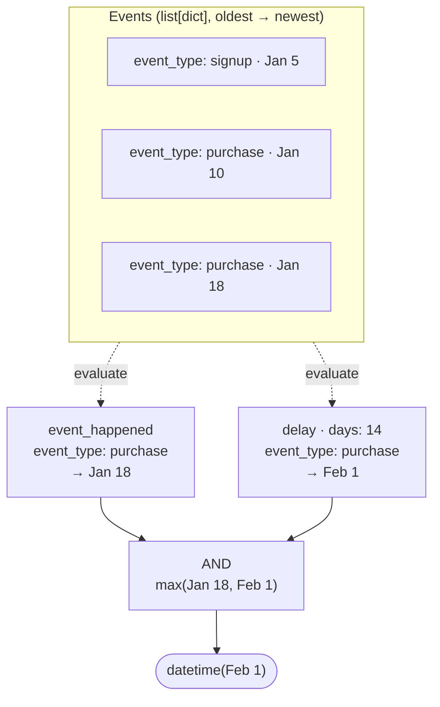

# londec — Longenesis Decision Maker

Evaluate tree-structured, JSON-serializable conditions against an ordered history of typed events. Each condition resolves to either `False` or the `datetime` it was first satisfied — enabling eligibility checks, scheduling triggers, and automation rules that are stored as data, not code.



---

## The problems londec solves

### Rules stored in a database, not compiled into code

Eligibility and scheduling logic tend to end up hardcoded: changing who qualifies for a feature requires a code change and a deploy. londec conditions are plain Python dicts — JSON-serializable, storable in a database, editable through a UI, and passed to `londec.decide` at runtime. The logic lives in data, not in a release.

```python
# Stored in DB, loaded at runtime — no deploy needed to update the rule
condition = {
    "type": "AND",
    "list": [
        {"type": "event_happened", "activity_id": "onboarding_complete"},
        {"type": "event_happened_fewer_than", "activity_id": "invoice_sent", "x": 3},
        {"type": "available_on_date_range", "start_date": "2026-01-01", "end_date": "2026-06-30", "timezone_offset": 120},
    ]
}

result = londec.decide(condition, events=user_events, field_map=FIELD_MAP)
```

This pattern fits naturally wherever rules vary per tenant, per plan, or per campaign — and need to be updated without touching application code.

### When — not just whether

A boolean answer is often not enough. If a rule is not yet satisfied, a scheduler needs to know *when* to check again. londec returns `False` when a condition is not satisfied, or the `datetime` it was first satisfied:

```python
result = londec.decide(
    {"type": "delay", "activity_id": "trial_started", "days": 14},
    events=user_events,
    field_map=FIELD_MAP,
)
# False          → trial never started; nothing to schedule
# datetime(...)  → the moment the 14-day window opens; schedule the follow-up for then
```

This makes londec useful not just for access control ("is this user eligible right now?") but for proactive scheduling ("when should this rule next be evaluated or triggered?").

Use cases that benefit from this:

- **Drip campaigns** — send a follow-up exactly N days after a user completed a step
- **Trial-to-paid conversion** — trigger an upsell prompt the moment a trial window closes
- **Loyalty rewards** — unlock a reward tier as soon as a user's Nth qualifying action is recorded
- **Time-gated content** — open the next module precisely when a prerequisite period has elapsed
- **Deployment pipelines** — schedule a production deploy for the earliest moment all gates are clear

### Composable conditions with datetime propagation

Conditions compose into AND/OR trees. When all branches resolve to datetimes, the combinator propagates them — rather than collapsing everything to a plain boolean — so the result remains useful for scheduling:

- `AND` (`MAX_AND`) — satisfied when the *last* prerequisite is met; returns the latest datetime
- `MIN_AND` — returns the earliest datetime (useful to know when the first prerequisite was met)
- `OR` (`MIN_OR`) — satisfied as soon as *any* branch is; returns the earliest datetime
- `MAX_OR` — returns the latest datetime across satisfied branches

```python
# "Eligible for a loyalty reward after placing 3 orders AND waiting 30 days since the first"
condition = {
    "type": "AND",
    "list": [
        {"type": "event_happened_at_least", "activity_id": "order_placed", "x": 3},
        {"type": "delay", "activity_id": "order_placed", "days": 30},
    ]
}
```

Nesting is unrestricted — OR inside AND, AND inside OR — allowing arbitrarily complex rules without writing new evaluator code.

### Checking data values across the event history

`payload_match` checks the value of any key in the event dict against an expected answer. It operates on the most recent event by default, or at a specific position in the event history via `seq_num`.

```python
# "The most recent assessment event has a risk_score of at least 7"
{"type": "payload_match", "activity_id": "assessment", "key": "risk_score", "answer": "7", "sub_type": "gte"}

# "The second-most-recent check-in had an engagement score below 3"
{"type": "payload_match", "activity_id": "check_in", "key": "engagement", "answer": "3", "sub_type": "lt", "seq_num": 1}

# "The most recent event of any type flagged the account for review"
# (no activity_id → checks across all event types)
{"type": "payload_match", "key": "review_flag", "answer": "true"}
```

`seq_num` counts from the most recent: `0` (default) is the latest, `1` is the second latest, and so on. Revoked events are excluded before indexing.

### Domain-agnostic — works with any flat event structure

londec has no opinion about your data model. Events are plain dicts; all keys londec needs must be present at the root level. You tell londec which keys carry the meaningful values through a `FieldMap`:

```python
from londec import FieldMap

FIELD_MAP = FieldMap(
    type_id="event_type",     # key that identifies the event type
    created_at="occurred_at", # key holding the event timestamp
    revoked_at="cancelled_at" # key holding the cancellation timestamp (None = active)
)
```

All other keys in the event dict — whether raw data, computed metrics, or anything else — are accessed directly by name in `payload_match` conditions. The caller is responsible for flattening nested structures and resolving any key collisions before passing events to londec.

### No I/O, no ORM, no framework

londec operates on a `list[dict]`. It has no database queries, no ORM models, no HTTP calls. The caller is responsible for fetching and preparing the event list; londec is responsible for evaluating the condition tree.

This makes londec straightforward to test — no database setup, no mocks, no fixtures beyond a list of plain dicts:

```python
def test_eligible_after_onboarding_delay():
    events = [
        {"event_type": "onboarding_complete", "occurred_at": datetime(2026, 3, 1, tzinfo=UTC), "cancelled_at": None},
    ]
    result = londec.decide(
        {"type": "delay", "activity_id": "onboarding_complete", "days": 7},
        events=events,
        field_map=FIELD_MAP,
    )
    assert result == datetime(2026, 3, 8, tzinfo=UTC)
```

---

## Core concepts

### Events

A `list[dict]` sorted oldest-first. londec requires flat dicts — all keys it needs to read must be at the root level. The caller is responsible for flattening nested structures before passing events to londec.

```python
events = [
    {
        "event_type": "account_created",
        "occurred_at": datetime(2026, 1, 1, tzinfo=UTC),
        "cancelled_at": None,
        "plan": "trial",
    },
    {
        "event_type": "order_placed",
        "occurred_at": datetime(2026, 1, 10, tzinfo=UTC),
        "cancelled_at": None,
        "amount": 49.00,
        "currency": "EUR",
        "lifetime_value": 49.00,
        "order_count": 1,
    },
    {
        "event_type": "order_placed",
        "occurred_at": datetime(2026, 2, 3, tzinfo=UTC),
        "cancelled_at": None,
        "amount": 79.00,
        "currency": "EUR",
        "lifetime_value": 128.00,
        "order_count": 2,
    },
]
```

A different system might use entirely different field names — londec works the same way, as long as the `FieldMap` describes the structure:

```python
events = [
    {
        "kind": "build",
        "ts": datetime(2026, 3, 10, 9, 0, tzinfo=UTC),
        "reverted_at": None,
        "branch": "main",
        "triggered_by": "push",
        "coverage": 91,
        "lint_errors": 0,
    },
    {
        "kind": "deploy",
        "ts": datetime(2026, 3, 10, 9, 45, tzinfo=UTC),
        "reverted_at": None,
        "environment": "staging",
        "version": "2.1.0",
        "smoke_passed": True,
        "response_time_ms": 210,
    },
]

FIELD_MAP = FieldMap(
    type_id="kind",
    created_at="ts",
    revoked_at="reverted_at",
)
```

### FieldMap

Maps three semantic roles to key names in your flat event dicts:

- `type_id` — the key that identifies what kind of event this is
- `created_at` — the key holding the event timestamp
- `revoked_at` — the key holding the cancellation/revocation timestamp (`None` means the event is active)

All other event data — raw values, computed metrics, flags — is accessed directly by key name in `payload_match` conditions.

### Condition

A plain dict with a `"type"` key. If `"type"` is absent, the condition is treated as unconditionally satisfied (`True`). Composite conditions use `"list"` to hold sub-conditions.

### Result: `bool | datetime`

- `False` — condition not satisfied
- `True` — condition satisfied, no timestamp available (e.g. `event_not_happened`)
- `datetime` — the moment the condition became satisfied

---

## Condition reference

### Event occurrence

| Type | Satisfied when | Returns |
|---|---|---|
| `event_happened` | At least one non-revoked event of `activity_id` exists | `created_at` of the most recent |
| `event_not_happened` | No non-revoked events of `activity_id` exist | `True` |
| `event_happened_exactly` | Exactly `x` non-revoked events of `activity_id` | `created_at` of the most recent |
| `event_happened_fewer_than` | Fewer than `x` non-revoked events | `True` |
| `event_happened_at_least` | `x` or more non-revoked events | `True` |
| `event_revoked` | A revoked event of `activity_id` exists | `revoked_at` of the most recent revoked event |

### Timing

| Type | Fields | Satisfied when | Returns |
|---|---|---|---|
| `delay` | `activity_id`, `days` | Always (if event exists) | `created_at + days` — the datetime the delay window opens |
| `is_taken_recently` | `activity_id`, `duration_type` (`"days"`/`"hours"`), `duration` | Most recent event is within `duration` of `now` | `created_at` of that event |
| `available_on_date_range` | `start_date`, `end_date` (ISO), `timezone_offset` (minutes) | `now` is within the date range | `start_date` (as datetime) |

### Payload matching

`payload_match` checks the value at `key` in the matching event dict. `activity_id` is optional — when omitted, the condition checks the Nth most recent event across all event types.

`seq_num` (int or string, default `0`) selects the event position: `0` is the most recent, `1` the second most recent, and so on. Revoked events are excluded before indexing.

| Field | Required | Description |
|---|---|---|
| `key` | Yes | Key to look up in the event dict |
| `answer` | Yes | Expected value |
| `activity_id` | No | Filter to events of this type only |
| `sub_type` | No | Expression evaluator (see below); defaults to strict equality |
| `seq_num` | No | Position index (default `0` = most recent) |

### Sequence

| Type | Fields | Satisfied when | Returns |
|---|---|---|---|
| `last_event_type_equals` | `activity_id`, `seq_num` | The event at position `seq_num` (most-recent-first) has `activity_id` | `created_at` of that event |

### Combinators

| Type | Alias | Behaviour |
|---|---|---|
| `AND` | `MAX_AND` | All sub-conditions must be satisfied; returns the **latest** datetime |
| `MIN_AND` | — | All must be satisfied; returns the **earliest** datetime |
| `OR` | `MIN_OR` | Any sub-condition must be satisfied; returns the **earliest** datetime |
| `MAX_OR` | — | Any must be satisfied; returns the **latest** datetime |

---

## `sub_type` expression evaluators

Used with `payload_match` to perform comparisons beyond strict equality.

| `sub_type` | Comparison |
|---|---|
| `equals` | Numeric equality, falls back to string equality |
| `ne` | Not equal (string comparison) |
| `gt` / `gte` | Numeric greater-than / greater-than-or-equal |
| `lt` / `lte` | Numeric less-than / less-than-or-equal |
| `in` | Value is in a list |
| `in_range` / `not_in_range` | Value within / outside `[min, max]` |
| `contains_any_of` | Collection contains at least one of the given items |
| `contains_none_of` | Collection contains none of the given items |
| `contains_all_of` | Collection contains all of the given items |
| `is_subset_of` | Value (as set) is a subset of the given set |
| `is_not_subset_of` | Value (as set) is not a subset of the given set |
| `true` / `false` | Value is truthy / falsy |
